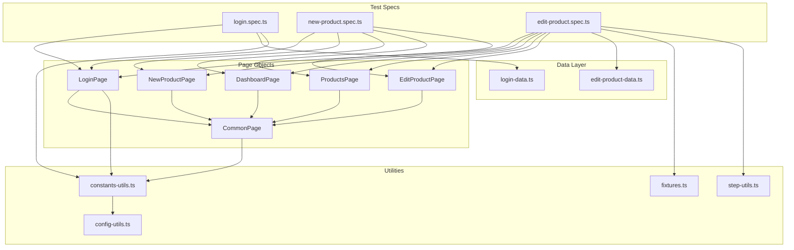

# Memory Bank — auto-ui-06

> **Last Updated:** 2026-04-19
> **Project Type:** Playwright UI Test Automation Framework
> **Target Application:** EverShop (e-commerce admin panel)
> **Language:** TypeScript (CommonJS)

---

## 1. Project Overview

`auto-ui-06` is a **Playwright-based end-to-end UI test automation framework** designed to test the **EverShop** open-source e-commerce admin panel. It follows the **Page Object Model (POM)** design pattern and supports **multi-environment** execution (local, staging) via environment-specific `.env` files.

### Key Capabilities
- Admin login validation (positive & negative scenarios)
- Product CRUD operations (create via UI, create via API, edit, delete via API)
- API route mocking (Playwright `page.route()`) to simulate server errors
- Allure reporting with automatic screenshot capture on failure
- Data-driven testing using parameterized test data arrays

---

## 2. Tech Stack & Dependencies

| Category | Technology | Version |
|---|---|---|
| Test Framework | Playwright Test | ^1.58.0 |
| Language | TypeScript | (via @types/node ^24.10.1) |
| Module System | CommonJS | `"type": "commonjs"` |
| Reporting | Allure (allure-playwright) | ^3.4.5 |
| Reporting CLI | allure | ^3.0.1 |
| Env Management | dotenv | ^17.2.3 |
| Object Comparison | deep-object-diff | ^1.1.9 |
| Browser | Chromium only (others commented out) | — |

---

## 3. Project Structure

```
auto-ui-06/
├── data/                           # Test data (organized by feature)
│   ├── login/
│   │   └── login-data.ts           # Invalid login scenarios (data-driven)
│   ├── new-product/
│   │   └── images/
│   │       └── bitis.jpg           # Product image for upload tests
│   └── edit-product/
│       └── edit-product-data.ts    # Product API request body template
│
├── env/                            # Environment configurations
│   ├── .env.local                  # Local env (port 3000)
│   └── .env.stg                   # Staging env (port 3001)
│
├── model/                          # Page Object Models & utilities
│   ├── common-page.ts              # Base page class (shared actions)
│   ├── pages/
│   │   ├── login-page.ts           # Login page actions
│   │   ├── dashboard-page.ts       # Dashboard page (currently empty)
│   │   ├── new-product-page.ts     # New product creation page
│   │   ├── edit-product-page.ts    # Edit product page
│   │   └── products-page.ts        # Products listing page
│   └── utils/
│       ├── config-utils.ts         # dotenv loader (env-aware)
│       ├── constants-utils.ts      # Global constants (URLs, credentials)
│       ├── fixtures.ts             # Custom Playwright fixtures (auto-screenshot)
│       └── step-utils.ts           # Allure step wrapper
│
├── tests/                          # Test specs
│   ├── example.spec.ts             # Playwright demo/example spec
│   ├── evershop/                   # EverShop test suites
│   │   ├── login/
│   │   │   └── login.spec.ts       # Login tests (valid + invalid)
│   │   ├── new-product/
│   │   │   └── new-product.spec.ts # Product creation tests (UI + mock)
│   │   └── edit-product/
│   │       └── edit-product.spec.ts# Product edit tests (API + UI)
│   └── web-elements/               # (excluded from analysis)
│
├── playwright.config.ts            # Playwright configuration
├── package.json                    # NPM dependencies & scripts
└── .gitignore                      # Git ignore rules
```

---

## 4. Architecture & Design Patterns

### 4.1 Page Object Model (POM)

All page interactions are encapsulated in page classes under `model/pages/`. Every page class extends `CommonPage`:

```
CommonPage (model/common-page.ts)
├── LoginPage
├── DashboardPage
├── NewProductPage
├── EditProductPage
└── ProductsPage
```

### 4.2 CommonPage — Base Class

`CommonPage` is the foundation of all page objects. It receives a Playwright `Page` instance and provides **generic, label-based interaction methods**:

| Method | Purpose |
|---|---|
| `inputTextboxByLabel(label, input)` | Fill input field found by label (XPath) |
| `inputTextByLabel(label, input)` | Clear + fill input field by label |
| `inputTextareaByLabel(label, input)` | Clear + fill textarea by label |
| `clickButtonByLabel(label)` | Click button by its text content |
| `selectDropdownByLabel(label, item)` | Select dropdown option by label |
| `clickRadioButtonByLabel(label, option)` | Click radio button by legend + label text |
| `clickMenuByLabel(label)` | Click admin navigation menu item |
| `verifyValidationMessageByLabel(label, msg)` | Assert field validation error is visible |
| `verifyPopupMessage(message)` | Assert alert/popup message is visible |
| `getFieldValueByLabel(label)` | Get input value by label |
| `buildCookieHeader()` | Extract `asid` & `sid` cookies for API calls |
| `deleteProductByApi(productId, cookies)` | DELETE product via API |
| `createProductByApi(requestBody, cookies)` | POST create product via API |

**Key Pattern:** All locators use **XPath** strategies based on label text, making tests resilient to structural DOM changes while coupling to visual labels. This is a deliberate convention — **do not switch to CSS selectors** without discussing with the team.

### 4.3 Custom Fixtures

`model/utils/fixtures.ts` extends Playwright's base `test` with an auto-fixture `forEachTest`:
- **Before test:** (hook point available, currently commented out)
- **After test:** If test status ≠ `passed`, captures a full-page screenshot and attaches it to the Allure report

**Usage:** Import `test` from `model/utils/fixtures` instead of `@playwright/test` to enable auto-screenshot. Currently used in `edit-product.spec.ts`.

### 4.4 Allure Step Wrapper

`model/utils/step-utils.ts` provides `iStep(name, action)` — a thin wrapper around `allure.step()` that names steps for better report readability:

```typescript
await iStep("Create product by API", async () => { /* ... */ });
```

**Convention:** Use `iStep` in test specs to wrap logical groups of actions for structured Allure reports.

---

## 5. Environment Configuration

### 5.1 How It Works

1. `config-utils.ts` reads `TEST_ENV` from `process.env` (defaults to `"local"`)
2. Loads `env/.env.${TEST_ENV}` via `dotenv`
3. `constants-utils.ts` exports derived constants:

| Constant | Value (local) | Value (stg) |
|---|---|---|
| `UI_HOST` | `http://localhost` | `http://localhost` |
| `UI_PORT` | `3000` | `3001` |
| `UI_BASE_URL` | `http://localhost:3000` | `http://localhost:3001` |
| `UI_ADMIN_LOGIN_URL` | `http://localhost:3000/admin/login` | `http://localhost:3001/admin/login` |
| `ADMIN_USERNAME` | `test@with.me` | `test@with.me` |
| `ADMIN_PASSWORD` | `1234567890` | `1234567890` |

### 5.2 Running Tests

```bash
# Run against local environment (default)
npm run test-local
# → npx playwright test tests/evershop

# Run against staging environment
npm run test-stg
# → TEST_ENV=stg npx playwright test tests/evershop

# Generate Allure report
npm run generate-report
# → npx allure awesome --single-file allure-results
```

---

## 6. Test Data Architecture

### 6.1 Data-Driven Login Tests

`data/login/login-data.ts` exports `invalidLogin` — an array of test cases, each containing:
```typescript
{
    testCaseName: string,        // Test title
    input: { [label]: value },   // Field label → input value
    expect: { [label]: message } // Field label → expected error message
}
```

**Scenarios covered:**
1. Email empty → "Email is required"
2. Password empty → "Password is required"
3. Both empty → Both error messages

### 6.2 Product API Template

`data/edit-product/edit-product-data.ts` exports `newProductBodyTemplate` — a JSON object matching the EverShop product creation API schema. Used by `edit-product.spec.ts` to create products via API before testing the edit flow.

**Key fields:** `name`, `sku`, `price`, `weight`, `tax_class`, `url_key`, `meta_title`, `meta_description`, `status`, `visibility`, `manage_stock`, `stock_availability`, `qty`, `group_id`, `images`, `attributes`

---

## 7. Test Suites

### 7.1 Login Suite (`tests/evershop/login/login.spec.ts`)

| Test | Approach |
|---|---|
| Verify admin login successful | UI: Fill email/password → click Sign In → assert "Dashboard" heading |
| Verify email is empty | Data-driven: parameterized from `invalidLogin` array |
| Verify password is empty | Data-driven: parameterized from `invalidLogin` array |
| Verify email and password are empty | Data-driven: parameterized from `invalidLogin` array |

**Pattern:** Uses `for...of` loop over `invalidLogin` to generate tests dynamically.

### 7.2 New Product Suite (`tests/evershop/new-product/new-product.spec.ts`)

| Test | Approach |
|---|---|
| Verify creating new product | UI: Full product creation flow via form → verify in product list |
| Verify creating new product 2 | UI: Same as above (duplicate for parallel/stress testing) |
| Verify error message on 500 error | UI + Mock: Uses `page.route()` to intercept API and return 500 → verify error popup |

**Key features:**
- Uses `Date().getTime()` for unique product names/SKUs
- `afterAll` hook cleans up created products via API (`deleteProductByApi`)
- Route mocking for negative server error scenarios

### 7.3 Edit Product Suite (`tests/evershop/edit-product/edit-product.spec.ts`)

| Test | Approach |
|---|---|
| Verify creating new product | API + UI: Create product via API → navigate to product list → search → open → verify fields |

**Key features:**
- Uses custom `test` fixture (from `fixtures.ts`) for auto-screenshot on failure
- Uses `iStep()` for structured Allure reporting
- Creates product via API using `newProductBodyTemplate`, then verifies via UI
- Cleanup via `afterAll` → API delete

---

## 8. Playwright Configuration

**File:** `playwright.config.ts`

| Setting | Value |
|---|---|
| `testDir` | `./tests` |
| `fullyParallel` | `true` |
| `forbidOnly` | `true` (on CI only) |
| `retries` | 2 (CI) / 0 (local) |
| `workers` | 1 (CI) / auto (local) |
| `reporter` | `["line", "allure-playwright"]` |
| `trace` | `on-first-retry` |
| `projects` | Chromium only (Firefox, WebKit, mobile, branded all commented out) |

---

## 9. Conventions & Patterns

### 9.1 Naming Conventions
- **Page classes:** PascalCase, suffixed with `Page` (e.g., `LoginPage`, `ProductsPage`)
- **Spec files:** kebab-case, suffixed with `.spec.ts` (e.g., `login.spec.ts`)
- **Data files:** kebab-case, suffixed with `-data.ts` (e.g., `login-data.ts`)
- **Utils:** kebab-case, suffixed with `-utils.ts` (e.g., `config-utils.ts`)

### 9.2 Locator Strategy
- **Primary:** XPath with `normalize-space()` for text matching
- **Secondary:** Playwright built-in locators (`getByRole`, `getByText`) — used sparingly
- **IDs:** Used only when available (e.g., `#field-keyword`, `#image-uploader-wrapper`)

### 9.3 Test Isolation
- Each test initializes its own page object instances in `beforeEach`
- Product cleanup is done in `afterAll` via API calls
- Unique data per test run via timestamp-based random values

### 9.4 Import Paths
- All imports use **relative paths** with `../` navigation
- No path aliases configured in `tsconfig.json`

---

## 10. Important Gotchas & Notes

1. **`@ts-ignore` usage:** Login spec uses `@ts-ignore` for dynamic property access on `data.input` and `data.expect` objects. This is intentional to support the data-driven pattern with dynamic field names.

2. **`deep-object-diff` dependency:** Listed in `package.json` but not currently used in any source file. Likely reserved for future product comparison assertions.

3. **Duplicate test in new-product spec:** `"Verify creating new product"` and `"Verify creating new product 2"` are nearly identical. This appears intentional for verifying test independence under parallel execution.

4. **`newProductBodyTemplate` mutation warning:** In `edit-product.spec.ts`, the template object is mutated directly (`requestBody.name = ...`). Since this is a module-level export, mutations persist across tests if multiple tests share the import. Currently safe because only one test uses it.

5. **Cookie-based API auth:** Tests extract browser cookies (`asid`, `sid`) to authenticate API calls. This means API-based setup/teardown requires a prior UI login.

6. **No `tsconfig.json` in repo:** TypeScript compilation is handled implicitly by Playwright's built-in TypeScript support.

7. **`example.spec.ts`:** This is the default Playwright scaffold test (tests playwright.dev). It runs alongside evershop tests when using `npx playwright test` without path filtering. The npm scripts scope to `tests/evershop` to avoid this.

---

## 11. File-by-File Reference

### Source Files (model/)

| File | Lines | Purpose |
|---|---|---|
| `model/common-page.ts` | 92 | Base page class with generic UI interaction methods and API helpers |
| `model/pages/login-page.ts` | 17 | Admin login flow (goto → fill → click → assert Dashboard) |
| `model/pages/dashboard-page.ts` | 10 | Empty page class (extends CommonPage, placeholder) |
| `model/pages/new-product-page.ts` | 19 | New product page: `isDisplay()` assertion + `uploadImage()` |
| `model/pages/edit-product-page.ts` | 18 | Edit product page: `isDisplay(name)` + `getProductId()` from URL |
| `model/pages/products-page.ts` | 25 | Products list: `isDisplay()`, `searchProduct()`, `selectProductByName()` |
| `model/utils/config-utils.ts` | 12 | `getEnv(name)` — loads env vars from `env/.env.{local\|stg}` via dotenv |
| `model/utils/constants-utils.ts` | 8 | Exports URL and credential constants derived from env vars |
| `model/utils/fixtures.ts` | 15 | Custom Playwright test fixture with auto-screenshot on failure |
| `model/utils/step-utils.ts` | 7 | `iStep(name, action)` — Allure step wrapper |

### Test Specs (tests/evershop/)

| File | Lines | Tests |
|---|---|---|
| `tests/evershop/login/login.spec.ts` | 28 | 4 tests (1 valid login + 3 data-driven invalid) |
| `tests/evershop/new-product/new-product.spec.ts` | 133 | 3 tests (2 UI creation + 1 API mock) |
| `tests/evershop/edit-product/edit-product.spec.ts` | 58 | 1 test (API create + UI verify) |

### Data Files (data/)

| File | Lines | Purpose |
|---|---|---|
| `data/login/login-data.ts` | 33 | 3 invalid login scenarios (data-driven) |
| `data/edit-product/edit-product-data.ts` | 39 | Product API request body template |

### Configuration

| File | Lines | Purpose |
|---|---|---|
| `playwright.config.ts` | 80 | Playwright test runner configuration |
| `package.json` | 25 | NPM package definition, scripts, dependencies |
| `env/.env.local` | 4 | Local environment variables |
| `env/.env.stg` | 4 | Staging environment variables |

---

## 12. Dependency Graph



---

## 13. Skills Required to Rebuild

1. **TypeScript** — modules, classes, inheritance, generics, async/await
2. **Playwright Test** — Page API, assertions, fixtures, route mocking, browser contexts, file uploads
3. **Page Object Model** — class inheritance, encapsulation of locators and actions
4. **XPath** — Advanced XPath expressions with `normalize-space()`, `contains()`, `concat()`
5. **Allure Reporting** — Steps, attachments, integration with Playwright
6. **dotenv** — Multi-environment configuration management
7. **REST API Testing** — Using Playwright `request` context for API calls with cookie authentication
8. **Data-Driven Testing** — Parameterized tests via arrays and loops
9. **EverShop Admin** — Understanding of the target application's UI structure and API endpoints
